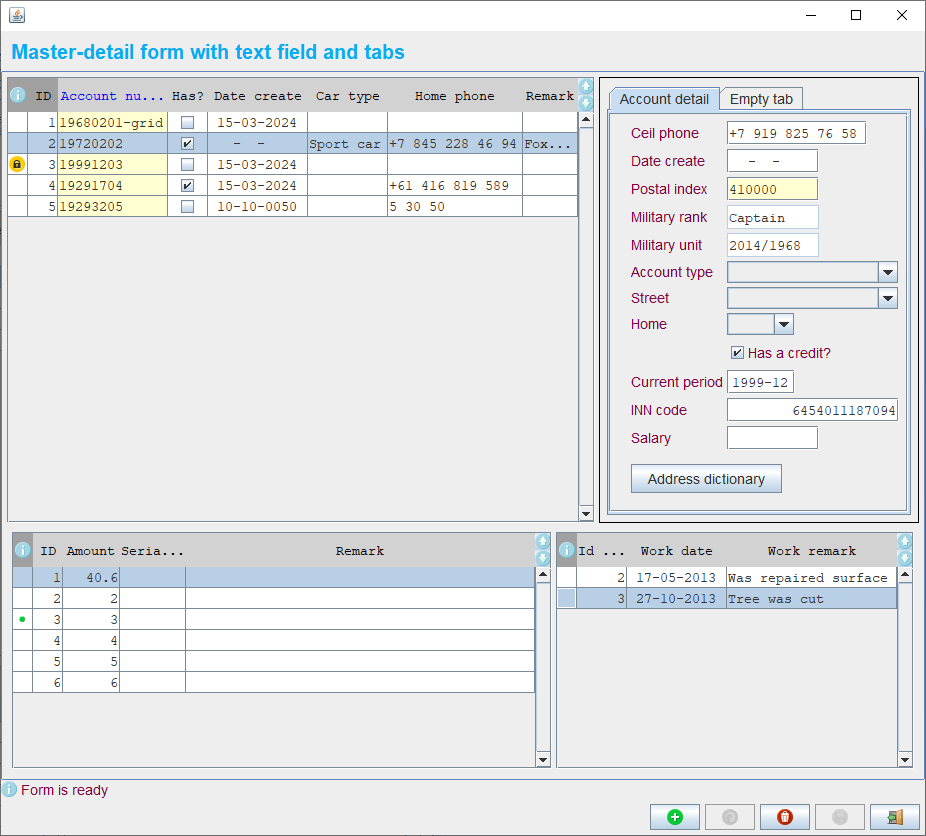

# DJF - Desktop Java Forms

Djf is a desktop java forms, the compact and litle master-detail UI library like FoxBase, but based on Swing.
Djf uses Hibernate mapping concepts for data, for component layout - Miglayout and RSyntaxTextArea for text panels.

Almost all of them, examples of forms definition, data bindings and assistances you can see in [demo application](https://github.com/smart-flex/Djf/releases/download/1.1/djf-demo-1.1-standalone.jar).
After downloading you can run this demo: java -jar djf-demo-1.1-standalone.jar



## Main features

This library allows:

* easily doing CRUD operations;
* viewing relationships between parent and more than one different kind of children; There can be various combinations, for example:
  + master table and its detail table(s);
  + master table and its nested detail table(s);
  + master table and its several detail fields with table(s);
  + several master tables and its detail table(s);
* reusing components such as: forms, panels, beans;
* each form has from none to n models and one control panel with folowing buttons: add record, refresh form, delete record, save, exit form;
* each form invokes other form (there is no limit);
* moving between UI-items without mouse (like in DOS forms) by using tab button, up-down arrows (with CTRL combination for text panels);
* adaptive displaying columns in the grid depending on the resolution;
* support fulfilment long operations with showing wait panel;
* support following widgets: table, tgrid (tree based on table), combobox and parent-child (linked) combobox, label, text, int, long, num, short, byte, date, textarea, checkbox, period, password, file, phone;

## Requirements

Djf requires JDK 1.6 or higher.

## Minimalistic code sample
```java
public class HelloWorldSimple {
    public static void main(String[] args) {
        Djf.getConfigurator().configure(null);
        Djf.runForm("ru/smartflex/djf/demo/xml/HelloWorldSimple.frm.xml", SizeFrameEnum.HALF);
    }
}
```
```xml
<form>
    <description>Hello world simple form</description>
    <layout clazz="java.awt.BorderLayout"/>
    <panel>
        <layout clazz="net.miginfocom.swing.MigLayout">
            <param type="string" value="align 50% 50%"/>
        </layout>
        <items>
            <label text="Djf just said: Hello world !!!" font="Arial:B30" fground="#09ACF2"/>
        </items>
    </panel>
</form>
```


#### Licensing

Djf is issued on under the GNU Lesser General Public License.

#### Support

If you have any issues or questions or suggestions you can send me a letter by email: <gali.shaimardanov@gmail.com>

